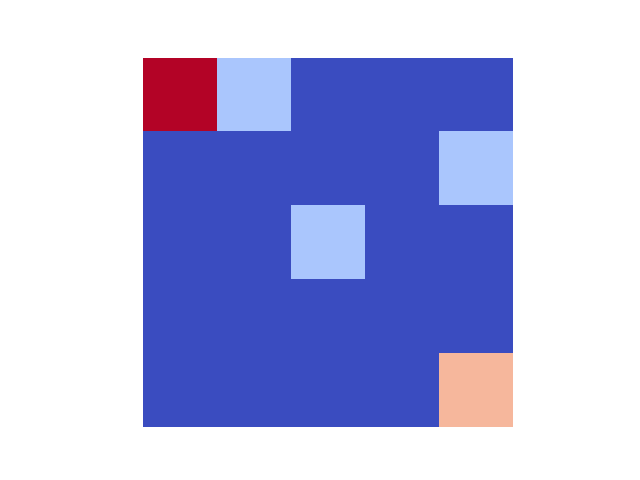

# GridWorld DQN Agent

This repository contains a Deep Q-Network (DQN) implementation for training an agent to collect gems in a GridWorld environment. The project is structured to separate environment logic, neural network models, replay buffer, training scripts, and evaluation utilities.

---

## Project Structure

```
+---buffers
|   buffer.py        # ReplayBuffer implementation
|   __init__.py
|
+---envs
|   environment.py   # GridWorld environment class
|   __init__.py
|
+---evaluation
|   test_model.py    # Scripts to evaluate trained models
|   utils.py         # Helper functions for evaluation
|
+---networks
|   q_network.py     # Q-network model (PyTorch)
|   __init__.py
|
+---saved_models
|   online.pth       # Pre-trained DQN model
|
+---trainers
|   dqn_trainer.py   # DQN training script
|   utils.py         # Helper functions for training (action selection, soft update)
|   __init__.py
```

---

## Installation

1. Clone the repository:

```bash
git clone https://github.com/jgomezba/deep_rl_dynamic_rewards.git
cd deep_rl_dynamic_rewards
```

2. Install docker

3. Launch docker image

```bash
docker-compose build
```

4. Run the container

```bash
docker-compose up -d
```

---

## Configuration

The agent is configured via `config.yaml`. Example parameters:

```yaml
grid_size: 5
n_gems: 3
start: [0, 0]
max_steps: 50
reward_step: -0.1
reward_gem: 1.0
reward_goal: 5.0
reward_invalid: -1.0
episodes: 500
batch_size: 32
lr: 0.001
gamma: 0.99
eps_start: 1.0
eps_end: 0.05
eps_decay: 0.995
replay_capacity: 10000
target_update_every: 100
```

---

## Usage

### Training

Run the DQN training script:

```bash
python trainers/dqn_trainer.py
```

This will:

- Train the Q-network using the GridWorld environment.
- Save the trained model to `saved_models/online.pth`.

### Evaluation

Use `evaluation/test_model.py` to evaluate a trained agent:

```bash
python evaluation/test_model.py
```

Features:

- Run multiple evaluation episodes.
- Render environment frames as GIFs in `gifs/`.
- Display total reward, steps, and gems collected per episode.

---

## Example Episode

Here’s an example episode from the evaluation:



---

## License

This project is MIT licensed.
